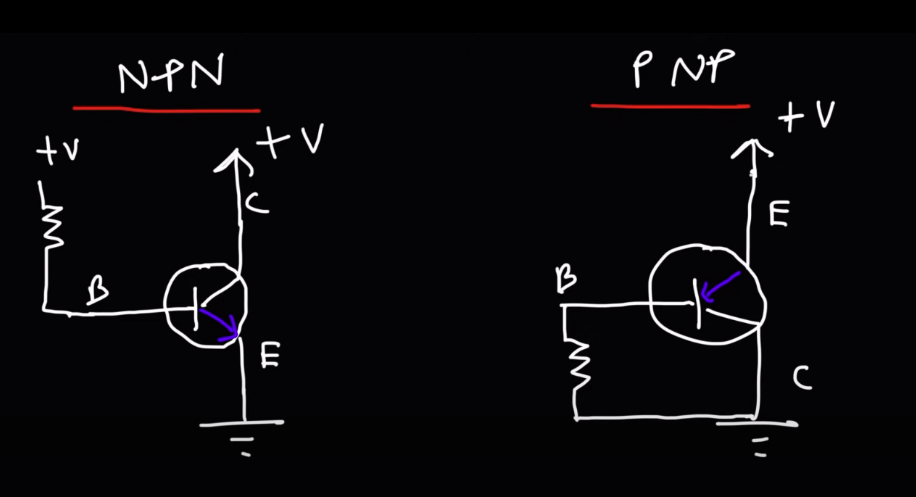
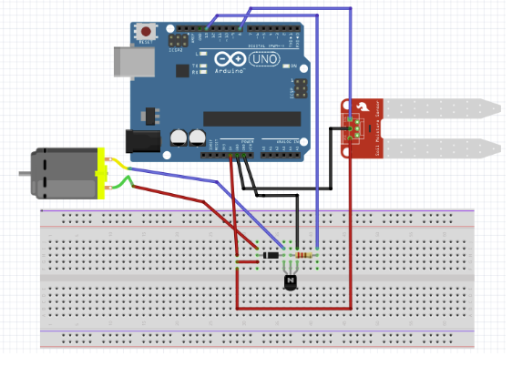

# Automated Water Pump System for Plants :

## Aim : 
A water pumping system for plants based on moisture content of the soil.

## Theory :  
In this system, soil moisture sensor senses the moisture level of the soil. If soil will get dry then sensor senses low moisture level and automatically switches on the water pump to supply water to the plant. As plant get sufficient water and soil get wet then sensor senses enough moisture in soil. After which the water pump will automatically get stopped. Also I've used a 5V DC motor which is not directly connected to the arduino as it might damage it, so I've made use of a npn transistor to act as a switch to power the motor. The base of the transistor is connected to a resistor so that the transistor doesn't get damaged due to high current flowing through it. You can refer the circuit diagram for transistor below.

## Materials Required :
- Arduino UNO
- 1N4007 - High voltage,high current rated diode
- NPN transistor
- Soil Moisture sensor
- Jumper wires
- resistor
- 5V DC motor
- Water tube
- Hot glue gun
- Water container
- Bread board

## Circuit diagram:

