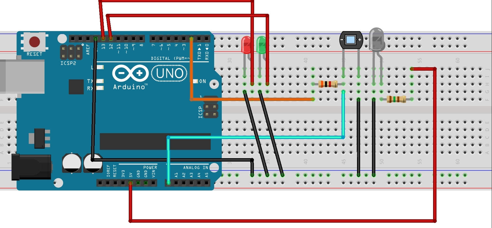

# Intruder Detection system using Arduino
## Aim : 
This is a beginner friendly simple obstruction sensor which is used to detect the presence of an obstruction and change the colour of the leds in response.

> **MATERIAL REQUIREMENTS**
> - 1 IR transmitter (generic)
> - 1 Photo Diode
> - 1 Arduino Uno
> - 1 3k resistor & 1 150 ohm resistor
> - 1 Breadboard (generic)
> - Jumper wires (generic)
> - LED (generic) 

[DOWNLOAD ARDUINO IDE](https://www.arduino.cc/en/software)

**Now ASSEMBLE THE THINGS**
1. IR LED Anode => 150 ohms resistor => 5v
2. IR Cathode => GND
3. PhotoDiode Anode => GND
4. PhotoDiode Cathode => 3k ohms resistor => D2
5. PhotoDiode Cathode => A0
6. Green LED => D13
7. Red LED => D12

 **Circuit Diagram for the same**

