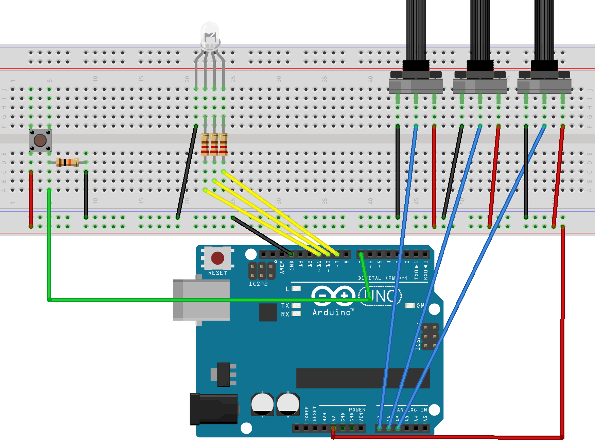

# RGB-LED Brightness controller
## Aim : This simple circuit combines three potentiometers to set the brightness for each of the red, green and blue LED's inside an RGB LED.
**SET UP INSTRUCTIONS**
> - Wire the diagram as shown in the schematics. The RGB Led is wired to PMW pins 9, 10 and 11 on the Arduino. The pushbutton is connected to pin 7 and the 3 potentiometers to A0, A1 and A2. Remember to add a 10K ohm pull up resistor to the ground connection on the pushbutton. For an explanation as to how this works, check out here [Pull UpDown Resistor](https://playground.arduino.cc/CommonTopics/PullUpDownResistor).
> - Also make sure to connect 3 220 ohm resistor's between the LED and the output pins, this will ensure your LED does not burn out.
> - The value of each Potentiometer is printed to the serial monitor, so if you are fiddling with the LED and find a color you like, you can record the RGB value to use later.
> - Once you have the circuit wired up and the sketch uploaded, try turning the knobs on the potentiometers. Nothing should happen at first until you hit the button. Now try turning the knobs again. The led should now light up. Time to play with light! Remember RGB light is not like mixing paint. when all the potentiometers are on full, the light should be white. Try leaving one of the potentiometers off or very low, and varying the other two.
> - An extension to this project would be to hard code some RBG values for particular colours you like, and add some more push buttons which, when pressed, would set the RGB LED to those colours. Feel free to share the code if you try an extension like this!

**MATERIAL REQUIREMENTS**

> **1.** ×	1	RGB LED,any 4 pin common ground RGB LED will work with this project.

> **2.** ×	1	Rotary potentiometer (generic)

> **3.** ×	3	SparkFun Pushbutton switch 12mm

> **4.** × 1 Resistor 10k ohm

> **5.** × 1 Resistor 221 ohm

> **6.** × 3 Breadboard (generic)

> **7.** × 1 Jumper wires (generic)

- CIRCUIT DIAGRAM FOR THE SAME.

