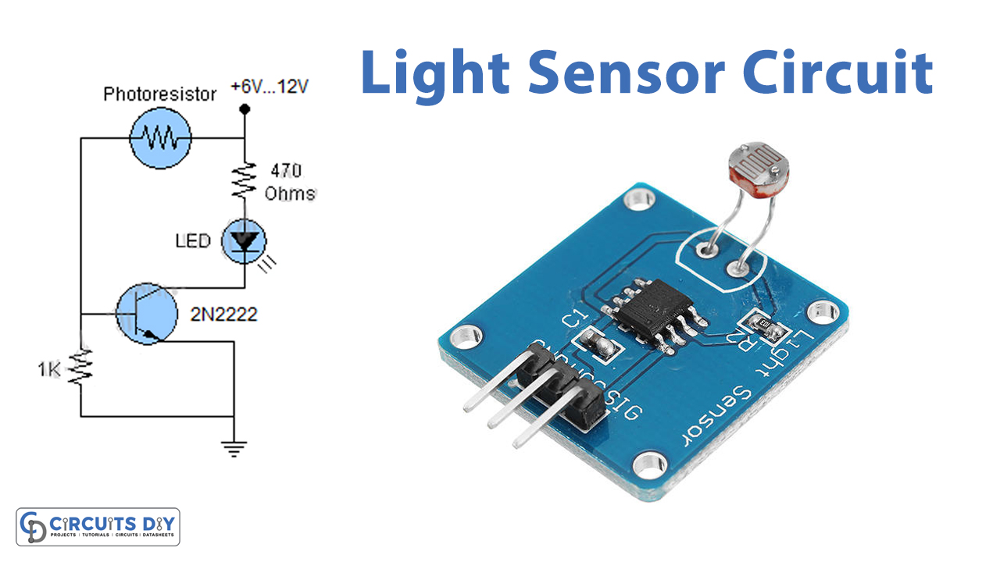
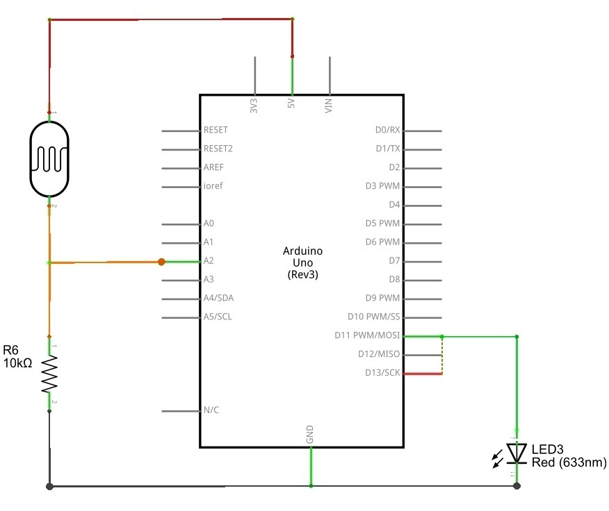

# Light Sensing system
- A Light Sensor is a device that detects light. It generates an output signal that is proportional to the intensity of light. A light sensor measures the radiant energy present in the wide range of frequencies in the light spectrum. Some of the common frequencies are infrared, visible and ultraviolet.
- In this project,I've designed a simple light sensor that indicates when the light is indicated. When the LDR detects a light over certain intensity, the Arduino will trigger the buzzer. When the intensity of light decreases, the buzzer is turned off.
- A photo resistor changes its resistance when light is incident on it. Hence, a photo resistor is also called as Light Dependent Resistor or LDR.When there is no light, the resistance of LDR is very high. When there is light incident on the LDR, its resistance decreases.

**Hardware Required**
>- Arduino UNO.
>- Light Dependent Resistor (LDR)
>- 100 KΩ POT
>- Buzzer

**Circuit Design of Light Sensor :**

As the photo resistor or LDR is a variable resistor, a voltage divider network must be used to gets the analog equivalent output from it.

A 100 KΩ POT and the LDR form a voltage divider and the output of the voltage divider is given to the analog input A0 of Arduino.

A buzzer is connected to pin 11 of Arduino.

