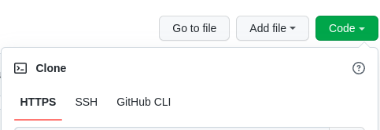
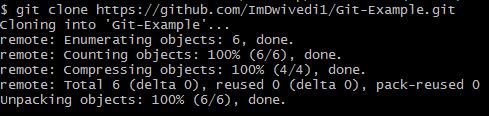

# 🎆 IoT-Projects-and-Scripts 🎇
<br>

## 🌟 Welcome to SarthakSKumar/IoT-Projects-and-Scripts.


>- Before sending your pull requests, make sure that you read the whole guidelines. If you have any doubt about the contributing guide, please feel free to reach out.
<br>

###### Kickstart your journey into the world 🌍 of IOT. This repo contains scripts for various Arduino based projects. Discover 🚢, Learn ✏️, Engage 👨‍💻 and Contribute

# 📈 Contributing to this Repo
	1.	Fork this repository.
	2.	Clone the forked repository. git clone https://github.com/<your-github-username>/project_name.git
	3.	Navigate to the project directory.
	4.	Creating a new branch (IMP) This is one of the very important step that you should follow to contribute in Open Source. A branch helps to manage the workflow, isolate your code and does not create a mess.


## Fork

**📌 Copy paste the url(HTTPS) from the dropdown menu under clone into the terminal**
<p> <p/>

```
git clone <HTTPS link>
```

### Refer to this following article for the remaining configuration steps [CONTRIBUTING.md](https://github.com/SarthakSKumar/IoT-Projects-and-Scripts/blob/master/CONTRIBUTING.md)
<br>

## 📩 Connect with me
Don't hesitate to ping me🤝. If you are interested to discuss any further, I'm always open for a conversation!!✔ <br>
Shoot me an email <a href = "mailto:sskworld9742@gmail.com">here</a> for official discussions. <br>
<p align = "justify">
 <a href = "https://www.linkedin.com/in/sarthakskumar/"></a>
 <a href = "https://facebook.com/sarthaks.kumar/"></a>
 <a href = "https://instagram.com/sarthakskumar/"></a>
 <a href = "https://t.me/sarthakskumar"></a>
 <a href = "https://discordapp.com/users/907567549410050078"></a>
 <a href = "https://twitter.com/SarthakSKumar2"></a>
</p>

## 📖Resources

1. Markdown: Markdown is a lightweight markup language like HTML, with plain text formatting syntax.
  * [Markdown Cheat-Sheet](https://github.com/adam-p/markdown-here/wiki/Markdown-Cheatsheet)

2. Git: Git is a distributed version control system for tracking changes in source code during software development. It is designed for coordinating work among programmers, but it can be used to track changes in any set of files.
  * [Videos to get started](https://www.youtube.com/watch?v=xAAmje1H9YM&list=PLeo1K3hjS3usJuxZZUBdjAcilgfQHkRzW)
  * [Cheat Sheet](https://www.atlassian.com/git/tutorials/atlassian-git-cheatsheet)

## 🤔Need more help?

You can refer to the following articles on the basics of Git and Github and can also contact me, in case you are stuck:
- [Forking a Repo](https://help.github.com/en/github/getting-started-with-github/fork-a-repo)
- [Cloning a Repo](https://help.github.com/en/desktop/contributing-to-projects/creating-an-issue-or-pull-request)
- [How to create a Pull Request](https://opensource.com/article/19/7/create-pull-request-github)
- [Getting started with Git and GitHub](https://towardsdatascience.com/getting-started-with-git-and-github-6fcd0f2d4ac6)
- [Learn GitHub from Scratch](https://lab.github.com/githubtraining/introduction-to-github)


<hr></hr>

## 📝List of contributors
💫 Thanks to all Wonderful People🧑👧 Who Have Contributed To This Repo ❤️<br><br>
<a href="https://github.com/SarthakSKumar/IoT-Projects-and-Scripts/graphs/contributors">
  
</a>
<hr>

© SarthakSKumar
