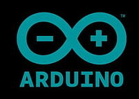
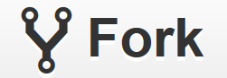

# 🎆 Arduino-Projects-and-Scripts 🎇
## 🌟 Welcome to SarthakSKumar/Arduino-Projects-and-Scripts. Before sending your pull requests, make sure that you read the whole guidelines. If you have any doubt about the contributing guide, please feel free to reach out. 
 

###### Kickstart your journey into the world 🌍 of Arduino's. This repo contains scripts for various Arduino based projects. Discover 🚢, Learn ✏️, Engage 👨‍💻 and Contribute 
# Contributing to this Repo
	1.	Fork this repository.
	2.	Clone the forked repository. git clone https://github.com/<your-github-username>/project_name.git
	3.	Navigate to the project directory.
	4.	Creating a new branch (IMP) This is one of the very important step that you should follow to contribute in Open Source. A branch helps to manage the workflow, isolate your code and does not create a mess. 
	5.	Make changes in source code.
	6.	Stage your changes and commit.
	7.	At this point you can use the git push command to push the changes to the current branch of your forked repository
	8.	Create a Pull Request/PR !
	9.	Congratulations! Sit and relax, you've made your contribution.

<p></p>
<p align = "justify"><hr></hr>
</p>

**📌 Copy paste the url(HTTPS) from the dropdown menu under clone into the terminal**
<p> <p/>

```
git clone <HTTPS link>
``` 
**For better info refer the following article** [configuration](https://github.com/SarthakSKumar/IoT-Projects-and-Scripts/blob/master/CONTRIBUTING.md)
List of contributors
> s
## 📩 Connect with me
Don't hesitate to ping me🤝. If you are interested to discuss any further, I'm always open for a conversation!!✔ <br>
Shoot me an email <a href = "mailto:sskworld9742@gmail.com">here</a> for official discussions. <br>
<p align = "justify">
 <a href = "https://www.linkedin.com/in/sarthakskumar/"></a>
 <a href = "https://facebook.com/sarthaks.kumar/"></a>
 <a href = "https://instagram.com/sarthakskumar/"></a>
 <a href = "https://t.me/sarthakskumar"></a>
 <a href = "https://discordapp.com/users/907567549410050078"></a>
 <a href = "https://twitter.com/SarthakSKumar2"></a>
</p>

<hr></hr>
